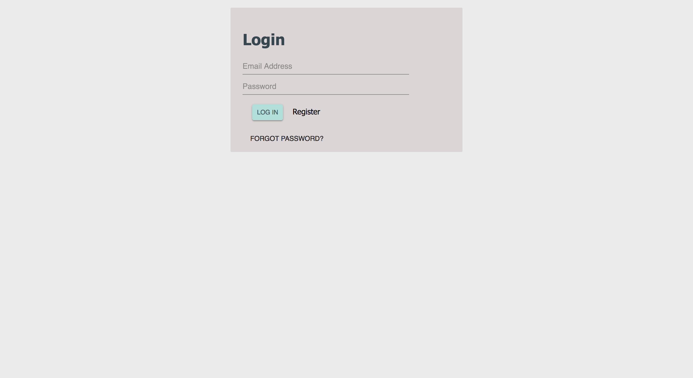

# ImpactHubMSP
Project ImpactHub is a visit-tracking application for local coworking space, Impact Hub MSP. The app is designed with an intuitive user interface that allows Impact Hub members and visitors to easily check themselves into the coworking space.  The app integrates with the Cobot API to provide a seamless transfer of data from the check-in desk to Impact Hub MSP’s Cobot account..

## Scope Document
https://docs.google.com/document/d/1oY9Uow1v0ioNsKaUkgfrAqzfyJtztJZcXDJwuJzligo/edit#

## Trello Board
https://trello.com/b/LyXnEMIn/impact-megasoft-corp

## Database Setup
Database is done with PostgreSQL, it should be created and called **"impact-hub-app'**.

To setup the database, use "database.sql" to create tables.

Test user accounts can be added to database using "test.sql" for the specified tables.

---

## Built With


## Database Set-Up

To start off with dummy data use the test.sql.
 

To set up this application on your computer, follow these instructions to create a new database for the local data to be stored. Included is a list of members that is inserted into the members table. 

Database is done with PostgreSQL, it should be created and called **"impact-hub-app'**.

```
CREATE TABLE "person" (
	"id" serial NOT NULL,
	"username" varchar(80) NOT NULL,
	"password" varchar(80) NOT NULL,
	CONSTRAINT person_pk PRIMARY KEY ("id")
) WITH (
  OIDS=FALSE
);

CREATE TABLE "checkin" (
	"id" serial NOT NULL,
	"day" DATE DEFAULT CURRENT_DATE,
	"time" TIME DEFAULT CURRENT_TIMESTAMP,
	"name" varchar(250) NOT NULL,
	"quantity" integer  DEFAULT 1,
	"member" BOOLEAN  DEFAULT false,
	"visitor" BOOLEAN  DEFAULT false,
	"purpose" varchar(250) NOT NULL,
	"checked_in" BOOLEAN DEFAULT true,
	"cobot_id" varchar(500) ,
	CONSTRAINT checkin_pk PRIMARY KEY ("id")
) WITH (
  OIDS=FALSE
);

CREATE TABLE "members" (
	"id" serial NOT NULL,
	"name" varchar(250) NOT NULL,
	"company" varchar(250) NOT NULL,
	"img_url" varchar(1000),
	"cobot_id" varchar(500) NOT NULL,
	CONSTRAINT members_pk PRIMARY KEY ("id")
) WITH (
  OIDS=FALSE
);

CREATE TABLE "mailinglist" (
	"id" serial NOT NULL,
	"name" varchar(250) NOT NULL,
	"phone" int NOT NULL,
	"email" varchar(250) NOT NULL,
	"date_time" TIMESTAMP DEFAULT CURRENT_TIMESTAMP,
	"init_welcome" BOOLEAN DEFAULT false,
	CONSTRAINT mailinglist_pk PRIMARY KEY ("id")
) WITH (
  OIDS=FALSE
);

  CREATE TABLE "messages" (
	"id" serial NOT NULL,
	"date_time" TIMESTAMP DEFAULT CURRENT_TIMESTAMP,
	"body" varchar(600),
	"cobot_id" varchar(500),
	"sender_name" varchar(255),
	CONSTRAINT twilio_pk PRIMARY KEY ("id")
) WITH (
  OIDS=FALSE
);


CREATE TABLE "twilioLogin" (
    admin_name character varying(50) PRIMARY KEY,
    phone_number bigint NOT NULL
);

CREATE UNIQUE INDEX "twilioLogin_pkey" ON "twilioLogin"(admin_name text_ops);


INSERT INTO "public"."members"("id","name","company","img_url","cobot_id")
VALUES
(38501,E'Julia',E'Finnegan\'s Brew Co.',E'https://d35ei1u0r0ivot.cloudfront.net/uploads/membership/photo/1ad9ab846758163c764b08daab701fd0/xlarge_e6fef707a8f30c1d46f62409671c6e0dd1b2b857fc485bd0a1f0a5423217e764.jpg',E'1ad9ab846758163c764b08daab701fd0'),
(38502,E'Dane',E'Sustainable Farming Association',E'https://d35ei1u0r0ivot.cloudfront.net/uploads/membership/photo/15a334a41abaa32c7a9407711715a3bf/xlarge_577550046f2b1ee51d587ab4f1dbed752d6f542b8db2b92e413cb5279bce46e2.jpeg',E'15a334a41abaa32c7a9407711715a3bf'),
(38503,E'Ahmed',E'Software for Good',E'https://d35ei1u0r0ivot.cloudfront.net/uploads/membership/photo/15a334a41abaa32c7a94077117aa3731/xlarge_ea6a07c5a0a9fe857235c3dc086c51bb8656ef1febc7b9b2118bffaf426652b5.jpg',E'15a334a41abaa32c7a94077117aa3731'),
(38504,E'Travis',E'Cogent',E'https://d35ei1u0r0ivot.cloudfront.net/uploads/membership/photo/1ad9ab846758163c764b08daab6f4595/xlarge_56cd1f0e099f9122a34c7a7db429c86956418025186e8a9c5030e82dc3495371.jpg',E'1ad9ab846758163c764b08daab6f4595'),
(38505,E'Kris',E'Finnegan\'s Brew Co.',E'https://d35ei1u0r0ivot.cloudfront.net/uploads/membership/photo/726b3dbf05db5de2fe4593deec1e2267/xlarge_d4baf17243663c61c9a9dcc21e00f231f4dd9663324892c7e863c35bac72a658.jpeg',E'726b3dbf05db5de2fe4593deec1e2267'),
(38506,E'Lars',E'Ecotone',E'https://d35ei1u0r0ivot.cloudfront.net/uploads/membership/photo/7c91c274ea396c7b25bb34f8eac0fc58/xlarge_40383d297ef8ec42981f74c421800570d6d55b8d3f7d6e8577c7edd056725689.jpg',E'7c91c274ea396c7b25bb34f8eac0fc58'),
(38507,E'Remmie',E'Cogent',E'https://d35ei1u0r0ivot.cloudfront.net/uploads/membership/photo/7c91c274ea396c7b25bb34f8eac14b34/xlarge_952e3a3bd6f2d528f030840397f7586e4fc7d681fe2470ae868f3cc4d69d7e42.jpg',E'7c91c274ea396c7b25bb34f8eac14b34'),
(38508,E'Ally',E'Software for Good',E'https://d35ei1u0r0ivot.cloudfront.net/uploads/membership/photo/7c91c274ea396c7b25bb34f8eac1dd93/xlarge_9587ad28ccece8ee6b19e08e2708759fead130bad13909535f2d4c5deba973c3.jpeg',E'7c91c274ea396c7b25bb34f8eac1dd93'),
(38509,E'Chris',E'Sustainable Farming Association',E'https://d35ei1u0r0ivot.cloudfront.net/uploads/membership/photo/7c91c274ea396c7b25bb34f8eac30035/xlarge_493d3394b2c0e0a754631734ffe6c33dfb147edaf4b5f90e2b57fc792d2fc7cd.jpeg',E'7c91c274ea396c7b25bb34f8eac30035'),
(38510,E'Justin',E'Finnegan\'s Brew Co.',E'https://d35ei1u0r0ivot.cloudfront.net/uploads/membership/photo/9db2395e4bd4e06c460e9dd7433c3375/xlarge_097ce00bfed8b4eb5c7d1694506107f221599aebb68c145144b5aaaf93eb0e4c.jpg',E'9db2395e4bd4e06c460e9dd7433c3375'),
(38511,E'Jennifer',E'Finnegan\'s Brew Co.',E'https://d35ei1u0r0ivot.cloudfront.net/uploads/membership/photo/9db2395e4bd4e06c460e9dd7433c5a08/xlarge_d1a69cb1a56f71f4bfb577b05d3252d0b7d3a35dadf7f69281d298e3177504af.jpg',E'9db2395e4bd4e06c460e9dd7433c5a08'),
(38512,E'Abbey',E'Software for Good',E'https://d35ei1u0r0ivot.cloudfront.net/uploads/membership/photo/9db2395e4bd4e06c460e9dd7433cb18c/xlarge_9c98cbd1d75de395b6d17699f67fb3fd9db2fce3f3aeb69b4db0a64ea9db3ece.jpg',E'9db2395e4bd4e06c460e9dd7433cb18c'),
(38513,E'Paul',E'Cogent',E'https://d35ei1u0r0ivot.cloudfront.net/uploads/membership/photo/9db2395e4bd4e06c460e9dd7435c2861/xlarge_5b19db72c8594ee0d028b3b2b0e45e566d4e1bfbabaed1e613c88ce64e39cdce.jpg',E'9db2395e4bd4e06c460e9dd7435c2861'),
(38514,E'Kyra',E'Ecotone',E'https://d35ei1u0r0ivot.cloudfront.net/uploads/membership/photo/9db2395e4bd4e06c460e9dd7435c7fe4/xlarge_a671b85647ce7effdd4e7b37c32f4a6ae5815cb6d8b71aca08c9297d26d0a4e7.jpg',E'9db2395e4bd4e06c460e9dd7435c7fe4'),
(38515,E'Dan',E'Sustainable Farming Association',E'https://d35ei1u0r0ivot.cloudfront.net/uploads/membership/photo/9db2395e4bd4e06c460e9dd7435cc226/xlarge_2e37beffcd1a6105f8084e251e6dd6162949114d832ede68cf250d51109ec9f4.jpg',E'9db2395e4bd4e06c460e9dd7435cc226'),
(38516,E'AJ',E'Software for Good',E'https://d35ei1u0r0ivot.cloudfront.net/uploads/membership/photo/b9632a7120da185473ab2b8fd6de1b0c/xlarge_141b206766b497207a41df37be5db50fc752c52a525c8f12bf288eda60c059e6.jpg',E'b9632a7120da185473ab2b8fd6de1b0c'),
(38517,E'Dev',E'Sustainable Farming Association',E'https://d35ei1u0r0ivot.cloudfront.net/uploads/membership/photo/b9632a7120da185473ab2b8fd6df4b68/xlarge_f6c9672b1d102c9c2fe5f56d39d6f355d589317965f21e993e5e16745b07eb35.png',E'b9632a7120da185473ab2b8fd6df4b68'),
(38518,E'Jakeh',E'Megasoft',E'https://d35ei1u0r0ivot.cloudfront.net/uploads/membership/photo/4799bbc6c7f9047b3953a270fb6b46a0/xlarge_9772099d42e74f588cc7bb02d1f4168e90954643a8106937a8c79a7051bf4982.jpg',E'4799bbc6c7f9047b3953a270fb6b46a0'),
(38519,E'Issac',E'Finnegan\'s Brew Co.',E'https://d35ei1u0r0ivot.cloudfront.net/uploads/membership/photo/1ad9ab846758163c764b08daab705ed0/xlarge_068f73ff0d13ad4cb7d9ed756f2e0916e021aa242adcf15f24d379030f620725.jpg',E'1ad9ab846758163c764b08daab705ed0'),
(38520,E'Lais',E'Megasoft',E'https://d35ei1u0r0ivot.cloudfront.net/uploads/membership/photo/4799bbc6c7f9047b3953a270fb6b1cf8/xlarge_b7e68ed226d32c0c93fd79358e006a8015eba8b0c690e137d0a45cd610b8f091.jpg',E'4799bbc6c7f9047b3953a270fb6b1cf8'),
(38521,E'Kara',E'Megasoft',E'https://d35ei1u0r0ivot.cloudfront.net/uploads/membership/photo/4799bbc6c7f9047b3953a270fb6b664a/xlarge_23e94057ef6a2a3a76cdf9e1a68f75b60da8cd4d17160609f4a0cae166e146ff.jpg',E'4799bbc6c7f9047b3953a270fb6b664a'),
(38522,E'Mai',E'Ecotone',E'https://d35ei1u0r0ivot.cloudfront.net/uploads/membership/photo/4cc92b755fc4a3180a8898e5381b19a4/xlarge_88fa06a8d6e56801fcf07b0e8e5637f631bbd78293bef94c57dbc06e64330cd0.jpg',E'4cc92b755fc4a3180a8898e5381b19a4'),
(38523,E'Sam',E'Megasoft',E'https://d35ei1u0r0ivot.cloudfront.net/uploads/membership/photo/5717a4826b719e68486dcb48c63d4fd2/xlarge_43df8b6b53f6cfe6b9873cc675f3e35b8baebebeeb65117c0f560d33e072003b.jpeg',E'5717a4826b719e68486dcb48c63d4fd2');

```

### Installing

Steps to get the development environment running.

1. Download this project.
2. Set-Up DB (above)
3. `npm install`
4. `npm run server`
5. `npm run client`

## Screen Shot




public/images/Group admin.png


### Features

* [x] Member check-in / check-out
* [x] Visitor check-in / check-out
  * [x] Add visitors to mailing list
* [x] Administrative View
  * [ ] Memebers present w/ info card
    * Name
    * Business / Mission
    * Role
    * Contact Info
    * Avatar Image
    * Website
    * Phone Number
  * [x] Group check-in
  * [x] Attendance Trends (Data Visualization)
  * [x] Retroactive check-in
  * [x] Messenger
  * [x] Twilio notifications

### Next Steps

- Added Styling
- Create more interactive graphs that syncs with live data

## Authors

* @k-burn (Kara Burnett)
* @sBahta1 (Sam Bahta)
* @lvang5 (Lais Vang)
* @maelstrm (Jakeh Clark)


## Acknowledgments

We would like to thank our wonderful project owners from **Impact Hub MPLS** & and the faculty of **Prime Digital Academy** for this wonderful opportunity and their continued support.
